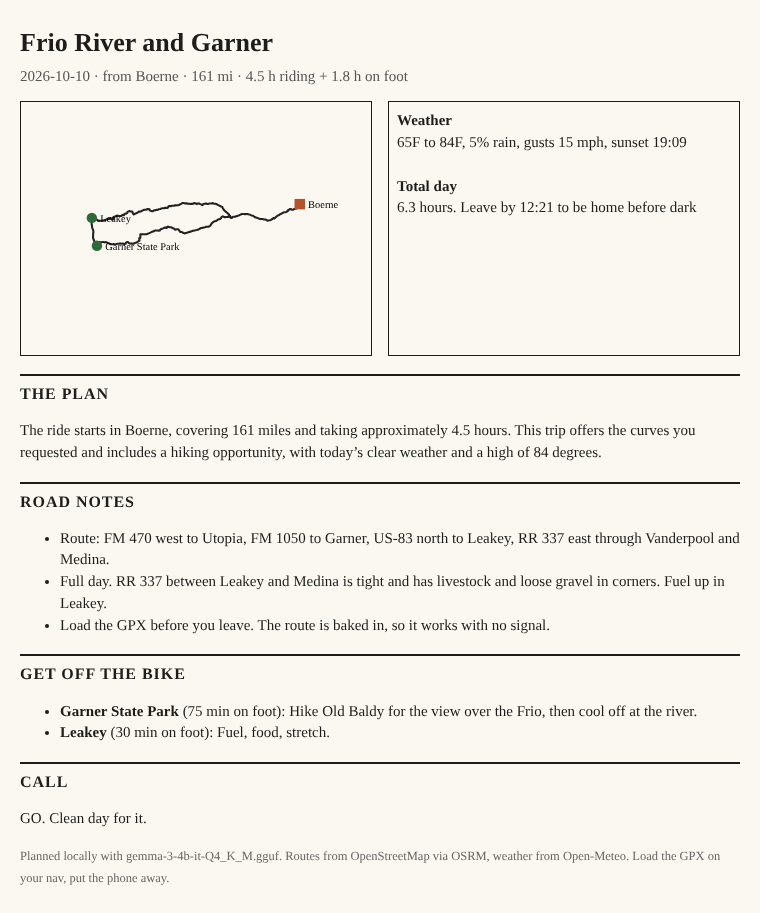

# ridecard

Plan a Texas Hill Country motorcycle day ride with a local open-weight model, print a one-page ride card, load the GPX, and put the phone away.

```
$ ridecard "about 6 hours from Boerne this saturday, want curves and to actually get off the bike and hike"

[ridecard] understood: start=Boerne hours=6.0 day=saturday->2026-10-10 wants=['twisties', 'hike']

Frio River and Garner  (Boerne, 2026-10-10)
## The plan
...
## Get off the bike
- Garner State Park (75 min on foot): Hike Old Baldy for the view over the Frio, then cool off at the river.
...
Wrote: out/2026-10-10-frio-garner.html, out/2026-10-10-frio-garner.gpx, out/2026-10-10-frio-garner.md
```



## What it does

1. **Understands the ask.** Gemma 3 (running on your machine) turns a plain sentence into a start town, time budget, day, and what you want (foliage, twisties, water, hike, food, history, wildlife).
2. **Picks a loop.** Seven hand-written Hill Country loops (Lost Maples, Devil's Backbone and River Road, Frio and Garner, Upper Guadalupe to Hunt, Enchanted Rock, Old Tunnel and Luckenbach, the 290 road) are scored on what you asked for, the season, and whether riding time plus time on foot fits your day.
3. **Builds the route** from OpenStreetMap data through OSRM and caches it, so it works with no signal once planned.
4. **Checks the sky** with Open-Meteo: rain, gusts, temperature, sunset, and a go or think-twice call.
5. **Writes the card.** The model writes two sentences. Roads, stops and hazards come from the catalog so a small model cannot invent a road or a restaurant.
6. **Outputs** a printable HTML card with a route outline, a GPX with the walking stops as waypoints, and a Markdown copy.

Every ride has stops where you park and walk. The screen is for five minutes in the driveway.

## Run it

Needs Python 3.10+. No pip dependencies for the core.

**With Ollama (recommended):**

```
ollama pull gemma3:4b
git clone https://github.com/anudeep-bonagiri/ridecard && cd ridecard
python3 -m ridecard "4 hours from San Antonio sunday, fall color by the river"
```

**With a GGUF file and llama-cpp-python, no server:**

```
pip install llama-cpp-python
RIDECARD_GGUF=./gemma-3-4b-it-Q4_K_M.gguf python3 -m ridecard "3 hours from Boerne, bats and history"
```

**Any other OpenAI-compatible local server** (llama.cpp server, LM Studio, vLLM): set `RIDECARD_LLM_URL` and `RIDECARD_MODEL`.

Flags: `--offline` uses only cached routes and skips the forecast. `--no-llm` uses keyword parsing and a template card.

Routes from Boerne and San Antonio ship pre-baked in `data/routes`. To bake another start: `python3 scripts/bake_routes.py Kerrville`.

## Why open models

- **Your location stays on your machine.** Where you live and where you ride on Saturday never goes to a hosted model.
- **It runs where there is no signal.** Gemma 3 4B in 4-bit is about 2.5 GB and runs on a laptop CPU. Cached routes plus a local model means it plans at a campsite in Leakey.
- **It costs nothing to run.** No API key, no meter.
- **It is swappable.** Any OpenAI-compatible local server works, so you can try a smaller model for an old laptop or fine-tune one on your own ride logs.

## Data and credits

Road geometry: OpenStreetMap contributors via the OSRM demo server. Geocoding: Nominatim. Weather: Open-Meteo. Model: Google Gemma 3 (open weights).

Ride notes are written by a rider, not a lawyer. Check Texas Parks and Wildlife for park hours and day pass reservations, and never ride a low water crossing with water over the road.

## License

MIT
